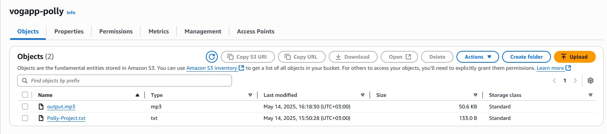
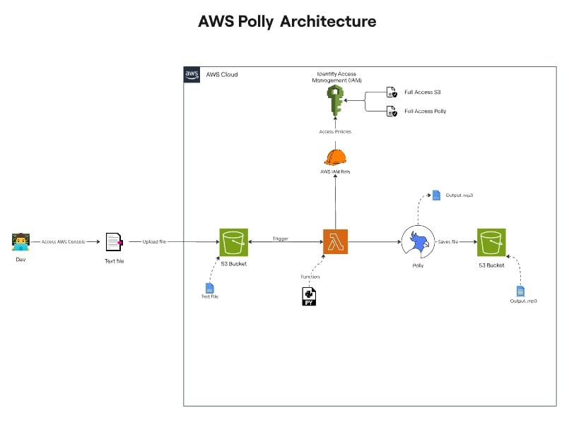
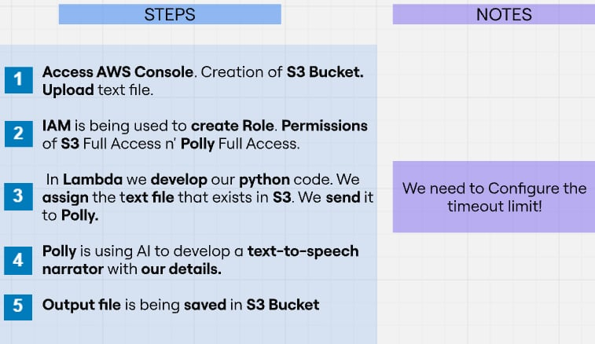

---- More Structured in the Architecture Folder ----

This is an AWS based Text-Narrator app! By using AWS resources, such as S3 Bucket, Lambda, IAM and Polly.

We start by conecting to our AWS account using through AWS Console. We create S3 Bucket and import our txt file.

With IAM we create roles and permissions.

Then we import our Python script to Lambda. We configure some settings in order to run correctly.

Lambda connects with S3 and Polly.

Polly is doing its magic and as a result we have an output mp3 file in our S3 Bucket!

 
<b>Results</b>
 

 

 
<b>Architecture</b>
 

 
 

<b>Steps</b>

